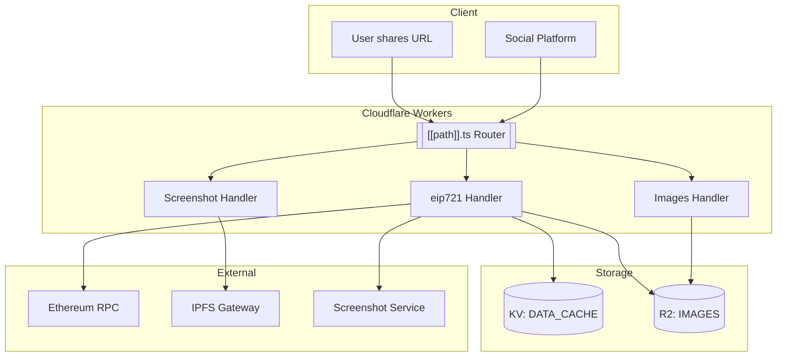

# Code Review: Embed.Art

**Date**: 2026-01-24  
**Project**: Embed.Art  
**Platform**: Cloudflare Pages/Workers  

## Project Overview

**Embed.Art** is a Cloudflare Pages/Workers application that generates embeddable previews for ERC-721 NFTs. It solves the problem that social platforms (Twitter, Facebook) don't support SVG images or `ipfs://` URLs in meta tags.

### How It Works

When a user navigates to `https://embed.art/eip155:<chainID>/erc721:<contractAddress>/<tokenID>`:

1. Fetches the `tokenURI` from the blockchain, along with current block and contract metadata
2. Caches the blockchain data in KV storage
3. Generates a preview image (using an external headless Chrome service) if none exists
4. Converts HTTP/IPFS resources to data URIs before screenshot generation (ensuring no network requests are needed during preview generation)
5. Saves the preview to R2 storage
6. Returns an HTML page displaying the NFT with title, description, image/audio, and iframe support

### Architecture Diagram



---

## Architecture Assessment

### Strengths ✅

1. **Clever Data URI Strategy**: The system pre-fetches IPFS/HTTP metadata and converts to data URIs before screenshot generation, ensuring the headless browser doesn't need network access (see [`generateDataURIForScreenshot()`](functions/_handlers/eip721.ts:40))

2. **Good Caching Strategy**: Uses KV for blockchain data caching and R2 for image storage with content-addressed keys including URI hash (see [`getData()`](functions/_handlers/eip721.ts:12))

3. **Finality-Aware Blockchain Reads**: Uses block finality offset of 12 blocks to avoid reading from potentially reorganized blocks (see [`finality`](functions/_utils/metadata.ts:76))

4. **Multi-Format Support**: Handles various tokenURI formats including data URIs, IPFS, and HTTP URLs (see [`parseMetadata()`](functions/_utils/metadata.ts:295))

5. **Clean Separation of Concerns**: Code is well-organized into handlers, utilities, and routes

---

## Issues & Recommendations

### 🔴 Critical Issues

#### 1. XSS Vulnerability in HTML Generation

**Location**: [`pageWithRawData.ts`](functions/_handlers/pageWithRawData.ts:25-51)

**Problem**: User-controlled metadata is directly interpolated into HTML without sanitization:

```typescript
<title>${title}</title>
<meta name="description" content="${description}">
```

**Risk**: Malicious NFT metadata could inject arbitrary HTML/JavaScript through the title or description fields.

**Recommendation**: Escape HTML entities or use a templating library with auto-escaping:

```typescript
import { escapeHTML } from './_utils/html';

<title>${escapeHTML(title)}</title>
<meta name="description" content="${escapeHTML(description)}">
```

---

#### 2. Missing TypeScript Types

**Location**: [`functions/images/[[path]].ts`](functions/images/[[path]].ts:1)

**Problem**: Function uses implicit `any` type:

```typescript
export async function onRequest(context) {  // no type
```

**Recommendation**: Add proper typing:

```typescript
export async function onRequest(context: {
  env: { IMAGES: R2Bucket };
  params: { path: string[] };
}) {
```

---

### 🟡 Medium Issues

#### 3. Hardcoded IPFS Gateway

**Locations**: 
- [`pageWithRawData.ts:175`](functions/_handlers/pageWithRawData.ts:175)
- [`metadata.ts:345`](functions/_utils/metadata.ts:345)
- [`screenshotWithAllData.ts:173`](functions/_handlers/screenshotWithAllData.ts:173)

**Problem**: All files hardcode `ipfs.io`:

```typescript
'https://ipfs.io/ipfs/' + tokenURI.slice(7)
```

**Recommendation**: Make this configurable via environment variable:

```typescript
const IPFS_GATEWAY = env.IPFS_GATEWAY || 'https://ipfs.io/ipfs/';
```

---

#### 4. Silent Error Swallowing

**Location**: [`fetchBlockchainData()`](functions/_utils/metadata.ts:169-214)

**Problem**: Contract name/symbol errors are silently caught:

```typescript
try {
  name = tokenURIInterface.decodeFunctionResult("name", json.result)[0];
} catch (err) {}  // silently swallowed
```

**Recommendation**: At minimum, log these failures for debugging:

```typescript
try {
  name = tokenURIInterface.decodeFunctionResult("name", json.result)[0];
} catch (err) {
  console.warn(`Failed to decode contract name: ${err.message}`);
}
```

---

#### 5. Hardcoded Fix for Specific Contract

**Location**: [`metadata.ts:270-283`](functions/_utils/metadata.ts:270-283)

**Problem**: Contains a hardcoded fix for a specific Rinkeby contract:

```typescript
if (
  chainId === "4" &&
  contract.toLowerCase() ===
    "0x72361C9f3d4475CE13dA1997D34aFFB350cB17fB".toLowerCase()
)
```

**Note**: Rinkeby (chainId 4) is deprecated and no longer active. This code can be removed.

---

#### 6. Unused Exports

**Location**: [`request.ts`](functions/_utils/request.ts:1-78)

**Problem**: Several exported functions appear unused:
- [`handleOptions()`](functions/_utils/request.ts:8)
- [`createJSONResponse()`](functions/_utils/request.ts:28)
- [`pathFromURL()`](functions/_utils/request.ts:41)
- [`parseGETParams()`](functions/_utils/request.ts:50)

**Recommendation**: Remove unused code or document if intended for future use.

---

### 🟢 Minor Issues

#### 7. Inconsistent Error Message Formatting

**Problem**: Error messages mix styles with inconsistent spacing around colons:

```typescript
`failed to get from DATA_CACHE : ${err.message}\n${err.stack}`  // extra space
`failed to put in DATA_CACHE : ${err.message}\n${err.stack}`    // inconsistent
```

**Recommendation**: Standardize format (prefer no space before colon):

```typescript
`Failed to get from DATA_CACHE: ${err.message}\n${err.stack}`
```

---

#### 8. TypeScript Suppression

**Location**: [`base64.ts`](functions/_utils/base64.ts:1-2)

**Problem**: Disables TypeScript checking:

```typescript
// @ts-ignore
// @ts-nocheck
```

**Note**: This is a vendored library from js-base64, so acceptable. Consider using the actual npm package instead.

---

#### 9. Outdated Dependencies

**Location**: [`package.json`](package.json:12-14)

**Problem**: Uses wrangler v2:

```json
"wrangler": "^2.12.0"
```

**Recommendation**: Current major version is v3. Consider upgrading.

---

#### 10. Missing Error Handling for Invalid Token IDs

**Location**: [`[[path]].ts:66`](functions/[[path]].ts:66)

**Problem**: Doesn't validate `tokenID` before passing to blockchain:

```typescript
const tokenID = splitted[2];  // could be undefined
const data = await getData(env, chainId, contract, tokenID);
```

**Recommendation**: Add validation:

```typescript
const tokenID = splitted[2];
if (!tokenID) {
  return new Response('Missing tokenID', { status: 400 });
}
```

---

#### 11. Typo in CSS

**Location**: [`pageWithRawData.ts:135`](functions/_handlers/pageWithRawData.ts:135)

**Problem**: Typo in inline style:

```typescript

```

Should be `display: none;` (colon, not equals).

---

#### 12. TODO Comments Without Resolution

**Locations**: Multiple files contain TODO comments:
- [`pageWithRawData.ts:193`](functions/_handlers/pageWithRawData.ts:193) - contract URI symbol + tokenID fallback
- [`eip721.ts:58`](functions/_handlers/eip721.ts:58) - animation_url for iframe

**Recommendation**: Create a tracking issue or implement these features.

---

## Code Quality Metrics

| Aspect | Rating | Notes |
|--------|--------|-------|
| **Architecture** | ⭐⭐⭐⭐ | Good separation of concerns |
| **Error Handling** | ⭐⭐⭐ | Exists but inconsistent, some silent failures |
| **Security** | ⭐⭐ | XSS vulnerability needs immediate attention |
| **TypeScript** | ⭐⭐⭐ | Used but with gaps in some handlers |
| **Documentation** | ⭐⭐⭐ | README good, inline docs sparse |
| **Maintainability** | ⭐⭐⭐ | Some hardcoding reduces flexibility |

---

## Recommended Priority Actions

### Immediate (Security)
1. **Fix XSS vulnerability** in HTML generation - sanitize all user-controlled content
2. **Add input validation** for token IDs and other parameters

### Short-term
3. Add proper TypeScript types to all handlers
4. Remove hardcoded Rinkeby workaround (deprecated network)
5. Fix CSS typo on line 135 of pageWithRawData.ts

### Medium-term
6. Make IPFS gateway configurable via environment variable
7. Upgrade wrangler from v2 to v3
8. Add logging for silent error cases

### Long-term
9. Clean up unused exports in request.ts
10. Address TODO comments or create tracking issues
11. Consider replacing vendored base64.ts with npm package

---

## File Structure Summary

```
embed-art/
├── index.html                 # Landing page with examples
├── package.json               # Dependencies (wrangler v2)
├── README.md                  # Project documentation
├── functions/
│   ├── [[path]].ts            # Main router
│   ├── images/
│   │   └── [[path]].ts        # R2 image handler (needs types)
│   └── _handlers/
│       ├── eip721.ts          # ERC-721 logic
│       ├── pageWithRawData.ts # HTML page generator (XSS risk)
│       └── screenshotWithAllData.ts # Screenshot renderer
└── functions/_utils/
    ├── base64.ts              # Vendored js-base64 (ts disabled)
    ├── metadata.ts            # Blockchain/metadata fetching
    ├── request.ts             # Unused helper functions
    ├── strings.ts             # String utilities
    └── url.ts                 # URL utilities